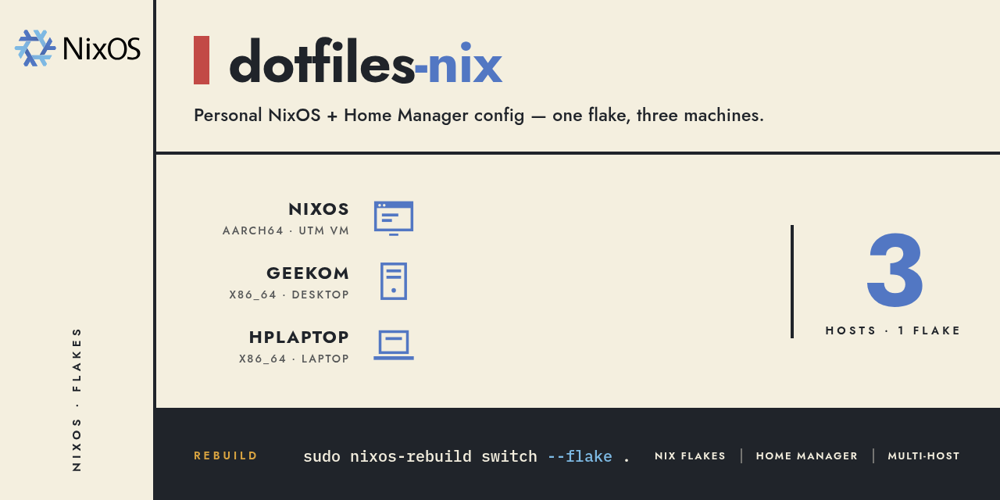

# dotfiles-nix



> **Public for learning purposes only.** This is my personal machine
> configuration, published so others can read, compare ideas, or fork it for
> their own setup. It is **not** a community project: Issues, Discussions,
> the Wiki, and Projects are disabled, and **PRs will not be accepted** — I
> don't review them, because every commit here is verified against my own
> machines first (a CI-green PR into `main` is what gets installed on the
> laptop, unattended). If something here helped you, fork it — the
> [license is MIT](#license) and stripping it to your machines is the
> intended use. See [`user.nix`](user.nix) for the one file to edit in a fork.

Personal NixOS configuration for **three machines built from one flake** — an
Apple Silicon development VM, an x86_64 desktop, and an x86_64 laptop for a
non-technical user. One command rebuilds the system and my `$HOME` on any of
them:

```sh
sudo nixos-rebuild switch --flake .
```

**No host attribute.** `nixos-rebuild` derives it from `networking.hostName`, so
the same command is correct on every host and there is nothing per-host to
remember or mistype.

## The hosts

| attr       | directory           | architecture    | machine                 | console                      |
| ---------- | ------------------- | --------------- | ----------------------- | ---------------------------- |
| `nixos`    | `hosts/vm/`         | `aarch64-linux` | UTM VM on Apple Silicon | cage + foot kiosk, autologin |
| `geekom`   | `hosts/geekom/`     | `x86_64-linux`  | GEEKOM A9 Max mini PC   | GNOME on GDM                 |
| `hplaptop` | `hosts/hplaptop/`   | `x86_64-linux`  | HP laptop (Intel i5)    | vanilla GNOME on GDM         |

> **The VM's two names are not a typo.** Its flake attr is `nixos` because that
> has to match `networking.hostName` — which is what the no-attr rebuild
> resolves against — while its directory is `hosts/vm/`. `bootstrap.sh` carries
> an explicit attr→directory mapping for exactly this reason: deriving
> `hosts/$HOST/` directly would fetch a 404 for the VM alone.

## The model

macOS is the host and stays imperative (always-latest apps, browser, mail).
The VM is the reproducible dev environment — not a daily driver, but the part
worth being able to rebuild from scratch and get back byte-for-byte. `geekom`
is a real desktop that gets sat at, so it runs GNOME and a browser rather
than a terminal kiosk. `hplaptop` is maintained on-site and updated by a
single alias.

Everything lives in a single flake with two layers folded together:

- **System layer** — `modules/nixos/` shared by every host, plus
  `hosts/<host>/default.nix` and `hosts/<host>/hardware-configuration.nix`
- **Home layer** — Home Manager, wired in as a NixOS module (not a standalone
  `home-manager switch`), so one `nixos-rebuild` builds both.

The split is the whole point of the multi-host layout: anything under
`modules/` is shared and moves **every** host when it changes, anything under
`hosts/` moves one. `scripts/check-hosts.sh` is how you find out which you just
did.

## Layout

```
flake.nix              nixosConfigurations.nixos (aarch64) + .geekom + .hplaptop (x86_64)
user.nix               personal identity — the one file to edit when forking
home.nix               Home Manager entrypoint — imports modules/home/
hosts/vm/              the aarch64 UTM VM
hosts/geekom/          the x86_64 mini PC
hosts/hplaptop/        the x86_64 HP laptop (non-technical user, no dev tooling)
  default.nix            hostName, stateVersion, hardware, display stack
  hardware-configuration.nix   by-label mounts, initrd modules
  disk-config.nix        disko layout — read by bootstrap.sh only, never imported
modules/nixos/         system layer, shared by every host
  common.nix             users, shell, system packages
  desktop.nix            defines AND consumes the `local.desktop` option
  dev.nix                defines AND consumes the `local.dev` option
modules/home/          one module per tool (zsh, git, neovim, …) — 100% Nix
  maintenance.nix        `nrb`/`ngca` aliases for non-dev hosts (no `nh`)
config/<tool>/…        verbatim assets referenced by the modules (nvim tree,
                       bat theme, fastfetch, zellij) — 100% non-Nix
doc/                   the documentation set — see the index below
scripts/check-hosts.sh the multi-host regression gate
scripts/pre-commit     git hook: nixfmt on staged .nix — self-installed by .envrc
statix.toml            statix (Nix linter) config — applies in CI and devShell
templates/devshell/    per-project dev shell template
templates/python-devshell/  per-project Python dev shell template (uv)
AGENTS.md              orientation for AI agents working in this repo
bootstrap.sh           one-command install of any host, from a live ISO
```

> **`modules/nixos/desktop.nix` is imported by every host, not just `geekom`.**
> It defines the `local.desktop` option as well as consuming it, so every host
> has to see it in order to leave it switched off. A host that cannot see an
> option cannot set it to `false`.

> **`local.desktop.variant` selects the desktop flavour.** `"full"` (PaperWM +
> Catppuccin on `geekom`) or `"vanilla"` (plain GNOME on `hplaptop`) — the HM
> theming modules key off it. The variant-specific reasoning lives in
> `modules/nixos/desktop.nix` and the host files.

## Documentation index

| document                       | what it covers                                            |
| ------------------------------ | --------------------------------------------------------- |
| [doc/install-vm.md](doc/install-vm.md)             | Installing the UTM VM: `bootstrap.sh`, SSH setup, manual fallback |
| [doc/bare-metal-geekom.md](doc/bare-metal-geekom.md) | The full bare-metal runbook: firmware, wifi, Bluetooth, suspend |
| [doc/bare-metal-hplaptop.md](doc/bare-metal-hplaptop.md) | The hplaptop delta: design constraints, suspend mask, updates via `nrb` |
| [doc/workflow.md](doc/workflow.md)                 | Rebuild aliases, which command from where, release upgrades, `/etc/nixos` cleanup |
| [doc/secrets.md](doc/secrets.md)                   | sops-nix: storage model, edit/rotate/rekey workflow, trust boundary, credential tiers |
| [doc/dev-environments.md](doc/dev-environments.md) | Per-project dev shells: the `devshell` template, direnv, SSH port forwards |
| [doc/vm-console.md](doc/vm-console.md)             | The cage + foot local console and its known limitations |
| [doc/troubleshooting.md](doc/troubleshooting.md)   | Gotchas that are not tied to one workflow |

## Quickstart pointers

- **Rebuild / update / roll back** → [doc/workflow.md](doc/workflow.md)
- **New machine** → [doc/install-vm.md](doc/install-vm.md) (VM) or
  [doc/bare-metal-geekom.md](doc/bare-metal-geekom.md) (hardware)
- **Something broke** → [doc/troubleshooting.md](doc/troubleshooting.md),
  and if the VM console is the only thing reachable:
  [doc/vm-console.md](doc/vm-console.md)

> **Forking?** Everything personal lives in one file, [`user.nix`](user.nix):
> `username`, `fullName`, `email`, `timeZone`, and `sshKey`. Edit it in your
> fork and commit _before_ installing — the install walkthroughs pick this up
> where it matters.

## License

[MIT](LICENSE) — fork, strip, and reuse freely; see [`user.nix`](user.nix) for
the one file to edit when forking. This repo is maintained for my own
machines only — see the notice at the top regarding contributions.
